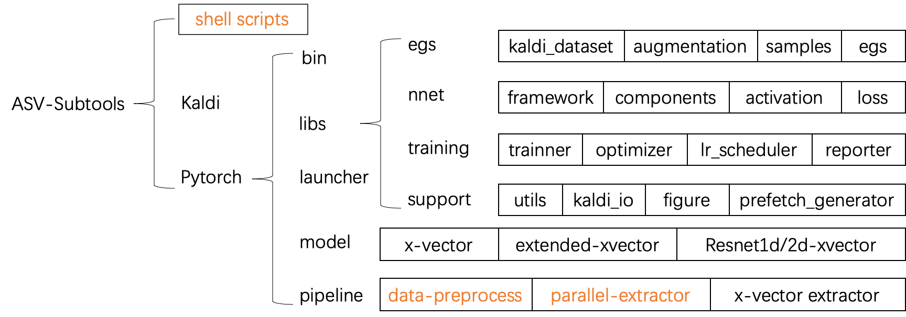
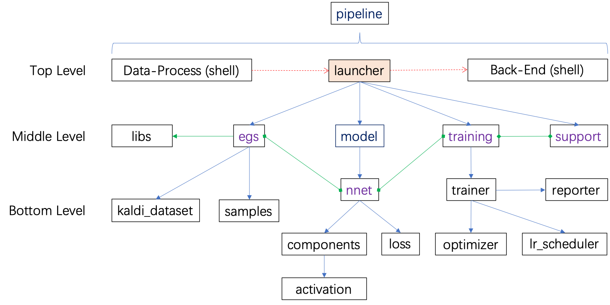
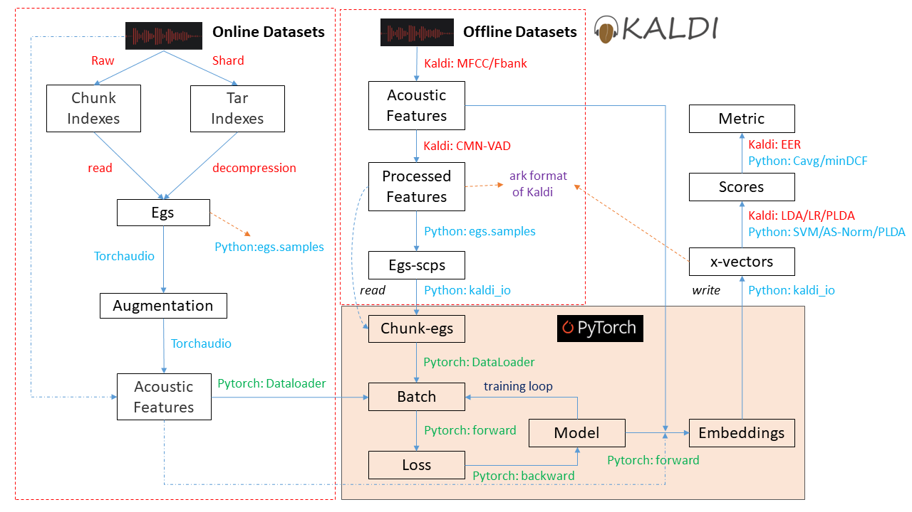
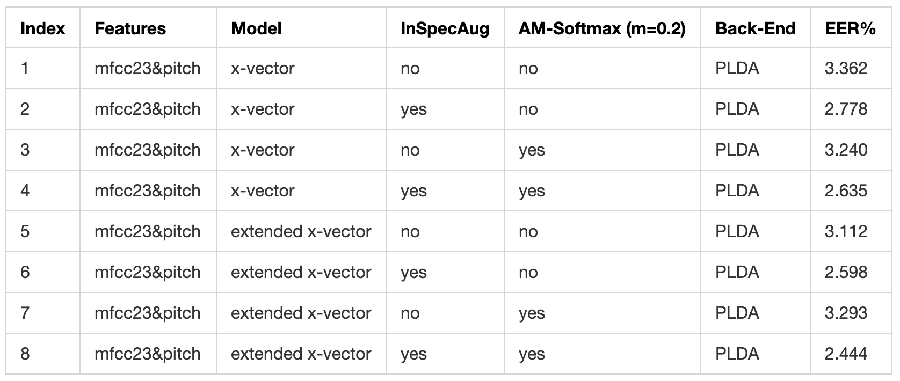
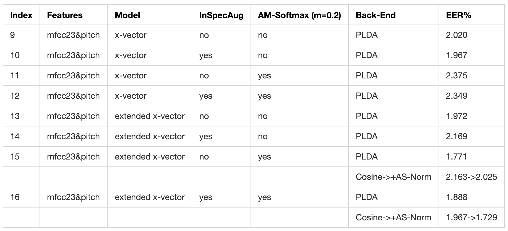
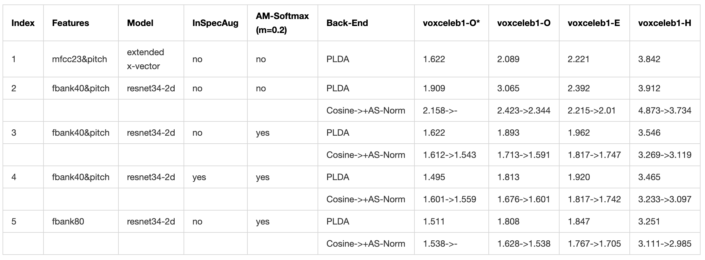

# ASV-Subtools: An Open Source Tools for Speaker Recognition

ASV-Subtools is developed based on [Pytorch](https://pytorch.org/) and [Kaldi](http://www.kaldi-asr.org/) for the task of speaker recognition, language identification, etc.  
The 'sub' of 'subtools' means that there are many modular tools and the parts constitute the whole. 

> Copyright: [XMU Speech Lab](https://speech.xmu.edu.cn/) (Xiamen University, China)  
> Apache 2.0
>
> Author   : Miao Zhao (Snowdar), Jianfeng Zhou, Zheng Li, Hao Lu  
> Co-author: Lin Li, Qingyang Hong

---
- **Content**
  * [Introduction](#introduction)
    + [Project Structure](#project-structure)
    + [Training Framework](#training-framework)
    + [Data Pipeline](#data-pipeline)
    + [Support List](#support-list)
  * [Ready to Start](#ready-to-start)
    + [1. Install Kaldi](#1-install-kaldi)
    + [2. Create Project](#2-create-project)
    + [3. Clone ASV-Subtools](#3-clone-asv-subtools)
    + [4. Install Python Requirements](#4-install-python-requirements)
    + [5. Support Multi-GPU Training](#5-support-multi-gpu-training)
    + [6. Extra Installation (Option)](#6-extra-installation-option)
      - [Train A Multi-Task Learning Model Based on Kaldi](#train-a-multi-task-learning-model-based-on-kaldi)
      - [Accelerate X-vector Extractor of Kaldi](#accelerate-x-vector-extractor-of-kaldi)
      - [Add A MMI-GMM Classifier for The Back-End](#add-a-mmi-gmm-classifier-for-the-back-end)
  * [Training Model](#training-model)
  * [Recipe](#recipe)
    + [[1] Voxceleb Recipe [Speaker Recognition]](#1-voxceleb-recipe-speaker-recognition)
    + [[2] AP-OLR Challenge 2020 Baseline Recipe [Language Identification]](#2-ap-olr-challenge-2020-baseline-recipe-language-identification)
  * [Feedback](#feedback)
  * [Acknowledgement](#acknowledgement)

<!--Table of contents generated with markdown-toc, see http://ecotrust-canada.github.io/markdown-toc-->
---

## Introduction  

In ASV-Subtools, [Kaldi](http://www.kaldi-asr.org/) is used to extract acoustic features and scoring in the back-end and [Pytorch](https://pytorch.org/) is used to build a model freely and train it with a custom style.

The project structure, training framework and data pipeline shown as follows could help you to have some insights into ASV-Subtools.

> By the way, **if you can not see the pictures in Github**, maybe you should try to check the DNS of your network or use a VPN agent. If you are a student of XMU, then the VPN of campus network could be very helpful for these types of problems (see [https://vpn.xmu.edu.cn](https://vpn.xmu.edu.cn) for a configuration). Of course, **at least the last way is to clone ASV-Subtools to your local notebook.**

### Project Structure  
ASV-Subtools contains **three main branches**:
+ Basic Shell Scripts: data processing, back-end scoring (most are based on Kaldi)
+ Kaldi: training of basic model (i-vector, TDNN, F-TDNN and multi-task learning x-vector)
+ Pytorch: training of custom model (less limitation)

</br>
<center></center>
</br>

For pytorch branch, there are **two important concepts**:
+ **Model Blueprint**: the path of ```your_model.py```
+ **Model Creation** : the code to init a model class, such as ```resnet(40, 1211, loss="AM")```

In ASV-Subtools, the model is individual, which means that we should know the path of ```model.py``` and how to initialize this model class at least when using this model in training or testing module. This structure is designed to avoid modifying codes of static modules frequently. For example, if the embedding extractor is wrote down as a called program and we use an inline method ```from my_model_py import my_model``` to import a fixed model from a fixed ```model.py``` , then it will be not free for ```model_2.py```, ```model_3.py``` and so on.

**Note that**, all models ([torch.nn.Module](https://pytorch.org/docs/stable/nn.html#torch.nn.Module)) shoud inherit [libs.nnet.framework.TopVirtualNnet](./pytorch/libs/nnet/framework.py) class to get some default functions, such as **auto-saving model creation and blueprint**, extracting emdedding of whole utterance, step-training, computing accuracy, etc.. It is easy to transform the original model of Pytorch to ASV-Subtools model by inheriting. Just modify your ```model.py``` w.r.t this [x-vector example](./pytorch/model/xvector.py).

### Training Framework  
The basic training framework is provided here and the relations between every module are very clear. So it will be not complex if you want to change anything when you want to have a custom ASV-Subtools.  

**Note that**, [libs/support/utils.py](./pytorch/libs/support/utils.py) has many common functions, so it is imported in most of ```*.py```.

</br>
<center></center>
</br>

### Data Pipeline  
Here, a data pipeline is given to show the relation between Kaldi and Pytorch. There are only two interfaces, **reading acoustic features** and **writing x-vectors**, and both of them are implemented by [kaldi_io](https://github.com/vesis84/kaldi-io-for-python).

Of course, this data pipeline could be also followed to know the basic principle of xvector-based speaker recognition.  

</br>
<center></center>
</br>

### Support List

- **Multi-GPU Training Solution**
  + [x] [DistributedDataParallel (DDP)](https://pytorch.org/docs/stable/nn.html#distributeddataparallel) [Built-in function of Pytorch]
  + [x] [Horovod](https://github.com/horovod/horovod)

- **Front-end**
  + [x] [Convenient Augmentation of Reverb, Noise, Music and Babble](./augmentDataByNoise.sh)
  + [x] Inverted [Specaugment](https://arxiv.org/pdf/1904.08779.pdf)

- **Model**
  + [x] [Standard X-vector](http://www.danielpovey.com/files/2017_interspeech_embeddings.pdf)
  + [x] [Extended X-vector](https://ieeexplore.ieee.org/stamp/stamp.jsp?tp=&arnumber=8683760)
  + [x] Resnet1d
  + [x] [Resnet2d](http://www.danielpovey.com/files/2019_interspeech_nist_sre18.pdf)
  + [ ] [F-TDNN X-vector](http://www.danielpovey.com/files/2019_interspeech_nist_sre18.pdf)

- **Component**
  + [x] [Attentive Statistics Pooling](https://arxiv.org/pdf/1803.10963v1.pdf)
  + [x] [Learnable Dictionary Encoding (LDE) Pooling](https://arxiv.org/pdf/1804.00385.pdf)
  + [x] [Multi-Head Attention Pooling](https://upcommons.upc.edu/bitstream/handle/2117/178623/2616.pdf?sequence=1&isAllowed=y) ==*new*== [The codes could be found [here](./pytorch/libs/nnet/pooling.py), by Snowdar.]
  + [x] [Global Multi-Head Attention Pooling](https://www.researchgate.net/publication/341085045_Multi-Resolution_Multi-Head_Attention_in_Deep_Speaker_Embedding) ==*new*==
  + [x] [Multi-Resolution Multi-Head Attention Pooling](https://www.researchgate.net/publication/341085045_Multi-Resolution_Multi-Head_Attention_in_Deep_Speaker_Embedding) ==*new*==
  + [x] [Sequeze and Excitation (SE)](https://arxiv.org/pdf/1709.01507.pdf) [A resnet1d-based SE example of speaker recognition could be found in this [paper](https://www.isca-speech.org/archive/Interspeech_2019/pdfs/1704.pdf), by Jianfeng Zhou.]

- **Loss Function**
  + [x] Softmax Loss (Affine + Softmax + Cross-Entropy)
  + [x] [AM-Softmax Loss](https://arxiv.org/pdf/1801.05599.pdf)
  + [x] [AAM-Softmax Loss](https://arxiv.org/pdf/1801.07698v1.pdf)
  + [x] [Double AM-Softmax Loss](https://www.mdpi.com/2076-3417/10/1/60)
  + [x] [Ring Loss](https://arxiv.org/pdf/1803.00130.pdf)

  <!--+ [x] [Curricular Margin Softmax Loss](https://arxiv.org/pdf/2004.00288.pdf)-->
  <!--It does not work in my experiments-->

- **Optimizer** [Out of Pytorch built-in functions]
  + [x] [Lookahead](https://arxiv.org/pdf/1907.08610.pdf) [A wrapper optimizer]
  + [x] [RAdam](https://arxiv.org/pdf/1908.03265v1.pdf)
  + [x] Ralamb [RAdam + [Layer-wise Adaptive Rate Scaling](https://openreview.net/pdf?id=rJ4uaX2aW) (LARS)]
  + [x] [Novograd](https://arxiv.org/pdf/1905.11286.pdf)
  + [x] [Gradient Centralization](https://arxiv.org/pdf/2004.01461.pdf) [Extra bound to optimizer]

- **Training Strategy**
  + [x] [AdamW](https://arxiv.org/pdf/1711.05101v1.pdf) + [WarmRestarts](https://arxiv.org/pdf/1608.03983v4.pdf)
  + [ ] SGD + [ReduceLROnPlateau](https://pytorch.org/docs/stable/optim.html#torch.optim.lr_scheduler.ReduceLROnPlateau)
  + [x] [Training with Magin Decay Stratagy](https://arxiv.org/pdf/1904.03479.pdf)
  + [x] [Heated Up Strategy](https://arxiv.org/pdf/1809.04157.pdf)
  + [x] [Multi-task Learning with Phonetic Information](http://yiliu.org.cn/papers/Speaker_Embedding_Extraction_with_Phonetic_Information.pdf) (Kaldi) [[Source codes](https://github.com/mycrazycracy/speaker-embedding-with-phonetic-information) was contributed by [Yi Liu](http://yiliu.org.cn/). Thanks.]
  + [ ] Multi-task Learning with Phonetic Information (Pytorch)
  + [ ] Generative Adversarial Networks (GAN)

- **Back-End**
  + [x] LDA, Submean, Whiten (ZCA), Vector Length Normalization
  + [x] Cosine Similarity
  + [x] Basic Classifiers: SVM, GMM, Logistic Regression (LR)
  + [x] PLDA Classifiers: [PLDA](https://ravisoji.com/assets/papers/ioffe2006probabilistic.pdf), APLDA, [CORAL](https://www.aaai.org/ocs/index.php/AAAI/AAAI16/paper/download/12443/11842), [CORAL+](https://arxiv.org/pdf/1812.10260), [LIP](http://150.162.46.34:8080/icassp2014/papers/p4075-garcia-romero.pdf), [CIP](https://ieeexplore.ieee.org/stamp/stamp.jsp?tp=&arnumber=9054113) [[Python versions](./score/pyplda) was contributed by Jianfeng Zhou. For more details, see the [note](./score/pyplda/Domain-Adaptation-of-PLDA-in-Speaker-Recognition.pdf).]
  + [x] Score Normalization: [S-Norm](http://www.crim.ca/perso/patrick.kenny/kenny_Odyssey2010_presentation.pdf), [AS-Norm](https://www.researchgate.net/profile/Daniele_Colibro/publication/221480280_Comparison_of_Speaker_Recognition_Approaches_for_Real_Applications/links/545e4f6e0cf295b561602c42/Comparison-of-Speaker-Recognition-Approaches-for-Real-Applications.pdf)
  + [ ] Calibration
  + [x] Metric: EER, Cavg, minDCF

- **Others**
  + [x] [Learning Rate Finder](https://sgugger.github.io/how-do-you-find-a-good-learning-rate.html)
  + [ ] Plot DET Curve with ```matplotlib``` w.r.t the Format of DETware (Matlab Version) of [NIST's Tools](https://www.nist.gov/itl/iad/mig/tools)
  + [ ] Accumulate Total MACs and Flops of Model Based on ```thop```

## Ready to Start  
### 1. Install Kaldi  
Pytorch-training is not much related to Kaldi, but we have not provided other interfaces to concatenate acoustic feature and training module now. So if you don't want to use Kaldi, you could change the [libs.egs.egs.ChunkEgs](./pytorch/libs/egs/egs.py) class where the features are given to Pytorch only by [torch.utils.data.Dataset](https://pytorch.org/docs/stable/data.html#torch.utils.data.Dataset). Besides, you should also change the interface of extracting x-vector after training. Note that, most of scripts which require Kaldi could be not available in this case, such as subtools/makeFeatures.sh and subtools/augmentDataByNoise.sh.

**If you prefer to use Kaldi, then install Kaldi firstly w.r.t http://www.kaldi-asr.org/doc/install.html.**

Here are conclusive stages:

```shell
# Download Kaldi
git clone https://github.com/kaldi-asr/kaldi.git kaldi --origin upstream
cd kaldi

# You could check the INSTALL file of current directory for more details of installation
cat INSTALL

# Compile tools firstly
cd tools
sh extras/check_dependencies.sh
make -j 4

# Config src before compiling
cd ../src
./configure --shared

# Check depend and compile
make depend -j 4
make -j 4
cd ..
```

### 2. Create Project  
Create your project with **4-level name** relative to Kaldi root directory (1-level), such as **kaldi/egs/xmuspeech/sre**. It is important for the project environment. For more details, see [subtools/path.sh](./path.sh).

```shell
# Suppose current directory is kaldi root directory
mkdir -p kaldi/egs/xmuspeech/sre
```

### 3. Clone ASV-Subtools  
ASV-Subtools could be seen as a set of tools like 'utils' or 'steps' of Kaldi, so there are only two extra stages to complete the final installation:
+ Clone ASV-Subtools to your project.
+ Install the requirements of python (**Python3 is recommended**).

Here is the method cloning ASV-Subtools from Github:

```shell
# Clone asv-subtools from github
cd kaldi/egs/xmuspeech/sre
git clone https://github.com/Snowdar/asv-subtools.git subtools
```

### 4. Install Python Requirements  
+ Pytorch>=1.2: ```pip3 install torch```
+ Other requirements: numpy, thop, pandas, progressbar2, matplotlib, scipy (option), sklearn (option)  
  ```pip3 install -r requirements.txt```

### 5. Support Multi-GPU Training  
ASV-Subtools provide both **DDP (recommended)** and Horovod solutions to support multi-GPU training.

**Some answers about how to use multi-GPU taining, see [subtools/pytorch/launcher/runSnowdarXvector.py](./pytorch/launcher/runSnowdarXvector.py). It is very convenient and easy now.**

Requirements List:  
+ DDP: Pytorch, NCCL  
+ Horovod: Pytorch, NCCL, Openmpi, Horovod  

**An Example of Installing NCCL Based on Linux-Centos-7 and CUDA-10.2**  
Reference: https://docs.nvidia.com/deeplearning/sdk/nccl-install-guide/index.html.  

```shell
# For a simple way, there are only three stages.
# [1] Download rpm package of nvidia
wget https://developer.download.nvidia.com/compute/machine-learning/repos/rhel7/x86_64/nvidia-machine-learning-repo-rhel7-1.0.0-1.x86_64.rpm

# [2] Add nvidia repo to yum (NOKEY could be ignored)
sudo rpm -i nvidia-machine-learning-repo-rhel7-1.0.0-1.x86_64.rpm

# [3] Install NCCL by yum
sudo yum install libnccl-2.6.4-1+cuda10.2 libnccl-devel-2.6.4-1+cuda10.2 libnccl-static-2.6.4-1+cuda10.2
```

These yum-clean commands could be very useful when you get some troubles when using yum.

```shell
# Install yum-utils firstly
yum -y install yum-utils

# Stop unfinished transactions
yum-complete-transaction --cleanup-only

# Clean duplicate and conflict
package-cleanup --cleandupes

# Clean cached headers and packages
yum clean all
```

If you want to install Openmpi and Horovod, see https://github.com/horovod/horovod for more details.

### 6. Extra Installation (Option)
There are some extra installations for some special applications.

#### Train A Multi-Task Learning Model Based on Kaldi
Use [subtools/kaldi/runMultiTaskXvector.sh](./kaldi/runMultiTaskXvector.sh) to train a model with multi-task learning,  but it requires some extra codes.
```shell
# Enter your project, such as kaldi/egs/xmuspeech/sre and make sure ASV-Subtools is cloned here
# Just run this patch to compile some extra C++ commands with Kaldi's format
cd kaldi/egs/xmuspeech/sre
sh subtools/kaldi/patch/runPatch-multitask.sh
```

#### Accelerate X-vector Extractor of Kaldi
It will spend so much time to compile nnet3 models for the utterances with different frames when extracting x-vectors based on Kaldi. To optimize this problem, ASV-Subtools provides an **offine** modification (MOD) in [subtools/kaldi/sid/nnet3/xvector/extract_xvectors.sh](./kaldi/sid/nnet3/xvector/extract_xvectors.sh) to accelerate extracting. This MOD requires two extra commands, **nnet3-compile-xvector-net** and **nnet3-offline-xvector-compute**. When extracting x-vectors, all model with different input chunk-size will be compiled firstly. Then the utterances which have the same frames could share a compiled nnet3 network. It saves much time by avoiding a lot of duplicate dynamic compilations.

Besides, the ```scp``` spliting type w.r.t length of utterances ([subtools/splitDataByLength.sh](./splitDataByLength.sh)) is adopted to balance the frames of different ```nj``` when multi-processes is used.

```shell
# Enter your project, such as kaldi/egs/xmuspeech/sre and make sure ASV-Subtools is cloned here
# Just run this patch to compile some extra C++ commands with Kaldi's format

# Target *.cc:
#     src/nnet3bin/nnet3-compile-xvector-net.cc
#     src/nnet3bin/nnet3-offline-xvector-compute.cc

cd kaldi/egs/xmuspeech/sre
sh subtools/kaldi/patch/runPatch-base-command.sh
```

#### Add A MMI-GMM Classifier for The Back-End
If you have run [subtools/kaldi/patch/runPatch-base-command.sh](./kaldi/patch/runPatch-base-command.sh), then it dosen't need to run again.

```shell
# Enter your project, such as kaldi/egs/xmuspeech/sre and make sure ASV-Subtools is cloned here
# Just run this patch to compile some extra C++ commands with Kaldi's format

# Target *.cc:
#    src/gmmbin/gmm-global-init-from-feats-mmi.cc
#    src/gmmbin/gmm-global-est-gaussians-ebw.cc
#    src/gmmbin/gmm-global-est-map.cc
#    src/gmmbin/gmm-global-est-weights-ebw.cc

cd kaldi/egs/xmuspeech/sre
sh subtools/kaldi/patch/runPatch-base-command.sh
```
## Training Model
If you have completed the [Ready to Start](#ready-to-start) stage, then you could try to train a model with ASV-Subtools.

For kaldi training, some launcher scripts named ```run*.sh``` could be found in [subtoos/Kaldi/](./kaldi).

For pytorch training, some launcher scripts named ```run*.py``` could be found in [subtools/pytorch/launcher/](./pytorch/launcher/). And some models named ```*.py``` could be found in [subtools/pytorch/model/](./pytorch/model).  Note that, model will be called in ```launcher.py```.

Here is a pytorch training example, but you should follow a [pipeline](./recipe/voxceleb/runVoxceleb.sh) of [recipe](#recipe) to prepare your data and features before training. The part of data preprocessing is not complex and it is the same as Kaldi. 

```shell
# Suppose you have followed the recipe and prepare your data and faetures, then the training could be run by follows.
# Enter your project, such as kaldi/egs/xmuspeech/sre and make sure ASV-Subtools is cloned here

# Firsty, copy a launcher to your project
cp subtools/pytorch/launcher/runSnowdarXvector.py ./

# Modify this launcher and run
# In most of time, there are only two files, model.py and launcher.py, will be changed.
subtools/runLauncher.sh runSnowdarXvector.py --gpu-id=0,1,2,3 --stage=0
```

## Recipe
### [1] Voxceleb Recipe [Speaker Recognition]
[Voxceleb](http://www.robots.ox.ac.uk/~vgg/data/voxceleb/index.html#about) is a popular dataset for the task of speaker recognition. It has two parts now, [Voxceleb1](http://www.robots.ox.ac.uk/~vgg/data/voxceleb/vox1.html) and [Voxceleb2](http://www.robots.ox.ac.uk/~vgg/data/voxceleb/vox2.html).

There are **two recipes for Voxceleb**:

**i. Test Voxceleb1-O only**

It means the trainset could be sampled from both Voxceleb1.dev and Voxceleb2 with a fixed training condition. The training script is available in [subtools/recipe/voxceleb/runVoxceleb.sh](./recipe/voxceleb/runVoxceleb.sh).

The voxceleb1 recipe with mfcc23&pitch features is available:  
**Link**: https://pan.baidu.com/s/1nMXaAXiOnFGRhahzVyrQmg  
**Password**: 24sg

```shell
# Download this recipe to kaldi/egs/xmuspeech directory
cd kaldi/egs/xmuspeech
tar xzf voxceleb1_recipe.tar.gz
cd voxceleb1

# Clone ASV-Subtools (Suppose the configuration of related environment has been done)
git clone https://github.com/Snowdar/asv-subtools.git subtools

# Train an extended x-vector model (Do not use multi-GPU training for it is not stable for specaugment.)
subtools/runPytorchLauncher.sh runSnowdarXvector-extended-spec-am.py --stage=0

# Score (EER = 2.444% for voxceleb1.test)
subtools/recipe/voxceleb/gather_results_from_epochs.sh --vectordir exp/extended_spec_am --epochs 21 --score plda
```

**Results of Voxceleb1-O with Voxceleb1.dev.aug1:1 Training only**



<!--
<table>
<tr style="white-space: nowrap;text-align:left;">
<th>Index</th>
<th>Features</th>
<th>Model</th>
<th>InSpecAug</th>
<th>AM-Softmax (m=0.2)</th>
<th>Back-End</th>
<th>EER%</th>
</tr>
<tr style="white-space: nowrap;text-align:left;">
<td>1</td>
<td>mfcc23&pitch</td>
<td>x-vector</td>
<td>no</td>
<td>no</td>
<td>PLDA</td>
<td>3.362</td>
</tr>
<tr style="white-space: nowrap;text-align:left;">
<td>2</td>
<td>mfcc23&pitch</td>
<td>x-vector</td>
<td>yes</td>
<td>no</td>
<td>PLDA</td>
<td>2.778</td>
</tr>
<tr style="white-space: nowrap;text-align:left;">
<td>3</td>
<td>mfcc23&pitch</td>
<td>x-vector</td>
<td>no</td>
<td>yes</td>
<td>PLDA</td>
<td>3.240</td>
</tr>
<tr style="white-space: nowrap;text-align:left;">
<td>4</td>
<td>mfcc23&pitch</td>
<td>x-vector</td>
<td>yes</td>
<td>yes</td>
<td>PLDA</td>
<td>2.635</td>
</tr>
<tr style="white-space: nowrap;text-align:left;">
<td>5</td>
<td>mfcc23&pitch</td>
<td>extended x-vector</td>
<td>no</td>
<td>no</td>
<td>PLDA</td>
<td>3.112</td>
</tr>
<tr style="white-space: nowrap;text-align:left;">
<td>6</td>
<td>mfcc23&pitch</td>
<td>extended x-vector</td>
<td>yes</td>
<td>no</td>
<td>PLDA</td>
<td>2.598</td>
</tr>
<tr style="white-space: nowrap;text-align:left;">
<td>7</td>
<td>mfcc23&pitch</td>
<td>extended x-vector</td>
<td>no</td>
<td>yes</td>
<td>PLDA</td>
<td>3.293</td>
</tr>
<tr style="white-space: nowrap;text-align:left;">
<td>8</td>
<td>mfcc23&pitch</td>
<td>extended x-vector</td>
<td>yes</td>
<td>yes</td>
<td>PLDA</td>
<td>2.444</td>
</tr>
</table>
-->

<!--HTML codes of table is generated by subtools/linux/generate_html_table_for_markdown.sh-->

**Results of Voxceleb1-O with Voxceleb1&2.dev.aug1:1 Training**



<!--
<table>
<tr style="white-space: nowrap;text-align:left;">
<th>Index</th>
<th>Features</th>
<th>Model</th>
<th>InSpecAug</th>
<th>AM-Softmax (m=0.2)</th>
<th>Back-End</th>
<th>EER%</th>
</tr>
<tr style="white-space: nowrap;text-align:left;">
<td>9</td>
<td>mfcc23&pitch</td>
<td>x-vector</td>
<td>no</td>
<td>no</td>
<td>PLDA</td>
<td>2.020</td>
</tr>
<tr style="white-space: nowrap;text-align:left;">
<td>10</td>
<td>mfcc23&pitch</td>
<td>x-vector</td>
<td>yes</td>
<td>no</td>
<td>PLDA</td>
<td>1.967</td>
</tr>
<tr style="white-space: nowrap;text-align:left;">
<td>11</td>
<td>mfcc23&pitch</td>
<td>x-vector</td>
<td>no</td>
<td>yes</td>
<td>PLDA</td>
<td>2.375</td>
</tr>
<tr style="white-space: nowrap;text-align:left;">
<td>12</td>
<td>mfcc23&pitch</td>
<td>x-vector</td>
<td>yes</td>
<td>yes</td>
<td>PLDA</td>
<td>2.349</td>
</tr>
<tr style="white-space: nowrap;text-align:left;">
<td>13</td>
<td>mfcc23&pitch</td>
<td>extended x-vector</td>
<td>no</td>
<td>no</td>
<td>PLDA</td>
<td>1.972</td>
</tr>
<tr style="white-space: nowrap;text-align:left;">
<td>14</td>
<td>mfcc23&pitch</td>
<td>extended x-vector</td>
<td>yes</td>
<td>no</td>
<td>PLDA</td>
<td>2.169</td>
</tr>
<tr style="white-space: nowrap;text-align:left;">
<td>15</td>
<td>mfcc23&pitch</td>
<td>extended x-vector</td>
<td>no</td>
<td>yes</td>
<td>PLDA</td>
<td>1.771</td>
</tr>
<tr style="white-space: nowrap;text-align:left;">
<td></td>
<td></td>
<td></td>
<td></td>
<td></td>
<td>Cosine->+AS-Norm</td>
<td>2.163->2.025</td>
</tr>
<tr style="white-space: nowrap;text-align:left;">
<td>16</td>
<td>mfcc23&pitch</td>
<td>extended x-vector</td>
<td>yes</td>
<td>yes</td>
<td>PLDA</td>
<td>1.888</td>
</tr>
<tr style="white-space: nowrap;text-align:left;">
<td></td>
<td></td>
<td></td>
<td></td>
<td></td>
<td>Cosine->+AS-Norm</td>
<td>1.967->1.729</td>
</tr>
</table>
-->

Note, 2000 utterances are selected from no-aug-trainset as the cohort set of AS-Norm, the same below.

---

**ii. Test Voxceleb1-O/E/H**

It means the trainset could only be sampled from Voxceleb2 with a fixed training condition. The training script is available in [subtools/recipe/voxcelebSRC/runVoxcelebSRC.sh](./recipe/voxcelebSRC/runVoxcelebSRC.sh).

**Results of Voxceleb1-O/E/H with Voxceleb2.dev.aug1:4 Training (EER%)**



<!--
<table style="font-size:14px;">
<tr style="white-space: nowrap;text-align:left;">
<th>Index</th>
<th>Features</th>
<th>Model</th>
<th>InSpecAug</th>
<th>AM-Softmax</br>(m=0.2)</th>
<th>Back-End</th>
<th>voxceleb1-O*</th>
<th>voxceleb1-O</th>
<th>voxceleb1-E</th>
<th>voxceleb1-H</th>
</tr>
<tr style="white-space: nowrap;text-align:left;">
<td>1</td>
<td>mfcc23&pitch</td>
<td>extended</br>x-vector</td>
<td>no</td>
<td>no</td>
<td>PLDA</td>
<td>1.622</td>
<td>2.089</td>
<td>2.221</td>
<td>3.842</td>
</tr>
<tr style="white-space: nowrap;text-align:left;">
<td>2</td>
<td>fbank40&pitch</td>
<td>resnet34-2d</td>
<td>no</td>
<td>no</td>
<td>PLDA</td>
<td>1.909</td>
<td>3.065</td>
<td>2.392</td>
<td>3.912</td>
</tr>
<tr style="white-space: nowrap;text-align:left;">
<td></td>
<td></td>
<td></td>
<td></td>
<td></td>
<td>Cosine->+AS-Norm</td>
<td>2.158->-</td>
<td>2.423->2.344</td>
<td>2.215->2.01</td>
<td>4.873->3.734</td>
</tr>
<tr style="white-space: nowrap;text-align:left;">
<td>3</td>
<td>fbank40&pitch</td>
<td>resnet34-2d</td>
<td>no</td>
<td>yes</td>
<td>PLDA</td>
<td>1.622</td>
<td>1.893</td>
<td>1.962</td>
<td>3.546</td>
</tr>
<tr style="white-space: nowrap;text-align:left;">
<td></td>
<td></td>
<td></td>
<td></td>
<td></td>
<td>Cosine->+AS-Norm</td>
<td>1.612->1.543</td>
<td>1.713->1.591</td>
<td>1.817->1.747</td>
<td>3.269->3.119</td>
</tr>
<tr style="white-space: nowrap;text-align:left;">
<td>4</td>
<td>fbank40&pitch</td>
<td>resnet34-2d</td>
<td>yes</td>
<td>yes</td>
<td>PLDA</td>
<td>1.495</td>
<td>1.813</td>
<td>1.920</td>
<td>3.465</td>
</tr>
<tr style="white-space: nowrap;text-align:left;">
<td></td>
<td></td>
<td></td>
<td></td>
<td></td>
<td>Cosine->+AS-Norm</td>
<td>1.601->1.559</td>
<td>1.676->1.601</td>
<td>1.817->1.742</td>
<td>3.233->3.097</td>
</tr>
<tr style="white-space: nowrap;text-align:left;">
<td>5</td>
<td>fbank80</td>
<td>resnet34-2d</td>
<td>no</td>
<td>yes</td>
<td>PLDA</td>
<td>1.511</td>
<td>1.808</td>
<td>1.847</td>
<td>3.251</td>
</tr>
<tr style="white-space: nowrap;text-align:left;">
<td></td>
<td></td>
<td></td>
<td></td>
<td></td>
<td>Cosine->+AS-Norm</td>
<td>1.538->-</td>
<td>1.628->1.538</td>
<td>1.767->1.705</td>
<td>3.111->2.985</td>
</tr>
</table>
-->

Note, Voxceleb1.dev is used as the trainset of back-end for the Voxceleb1-O* task and Voxceleb2.dev for others. 


 > **These basic models performs good but the results are not the state-of-the-art yet**. I found that training strategies could have an important influence on the final performance, such as the number of epoch, the value of weight decay, the selection of optimizer, and so on. Unfortunately, I have not enough time and GPU to fine-tune so many models, especially training model with a large dataset like Voxceleb2 whose duration is more than 2300h (In this case, it will spend 1~2 days to train one fbank80-based Resnet2d model for 6 epochs with 4 V100 GPUs).
 >
 > --#--Snowdar--2020-06-02--#--

---

### [2] AP-OLR Challenge 2020 Baseline Recipe [Language Identification]

AP-OLR Challenge 2020  is opened now, welcome to register by the [home page](http://cslt.riit.tsinghua.edu.cn/mediawiki/index.php/OLR_Challenge_2020). 

**Baseline**: [subtools/recipe/ap-olr2020-baseline](./recipe/ap-olr2020-baseline).  
> The **top training script of baseline** is available in [subtools/recipe/ap-olr2020-baseline/run.sh](./recipe/ap-olr2020-baseline/run.sh). And the baseline results could be seen in [subtools/recipe/ap-olr2020-baseline/results.txt](./recipe/ap-olr2020-baseline/results.txt).

**Plan**: Zheng Li, Miao Zhao, Qingyang Hong, Lin Li, Zhiyuan Tang, Dong Wang, Liming Song and Cheng Yang: [AP20-OLR Challenge: Three Tasks and Their Baselines](https://arxiv.org/pdf/2006.03473.pdf), submitted to APSIPA ASC 2020.

**Important Dates**:  
Jun. 1, AP20-OLR training/dev data release.  
Oct. 1, register deadline.  
Oct. 20, test data release.  
Nov. 1, 24:00, Beijing time, submission deadline.  
Nov. 27, convening of seminar.  
Dec. 10, results announcement.  

For previous challenges (2016-2019), see http://olr.cslt.org.

---

## Feedback
+ If you find bugs or have some questions, please create a github issue in this repository to let everyone knows it, so that a good solution could be contributed.
+ If you want to ask me any questions, you can also send e-mail to snowdar@stu.xmu.edu.cn and I will reply in my free time.

## Acknowledgement
+ Thanks to everyone who contribute their time, ideas and codes to ASV-Subtools.
+ Thanks to [XMU Speech Lab](https://speech.xmu.edu.cn/) providing machine and GPU.
+ Thanks to the excelent projects: [Kaldi](http://www.kaldi-asr.org/), [Pytorch](https://pytorch.org/), [Kaldi I/O](https://github.com/vesis84/kaldi-io-for-python), [Numpy](https://numpy.org/), [Pandas](https://pandas.pydata.org/), [Horovod](https://github.com/horovod/horovod), [Progressbar2](https://github.com/WoLpH/python-progressbar), [Matplotlib](https://matplotlib.org/index.html), [Prefetch Generator](https://github.com/justheuristic/prefetch_generator), [Thop](https://github.com/Lyken17/pytorch-OpCounter), [GPU Manager](https://github.com/QuantumLiu/tf_gpu_manager), etc.
