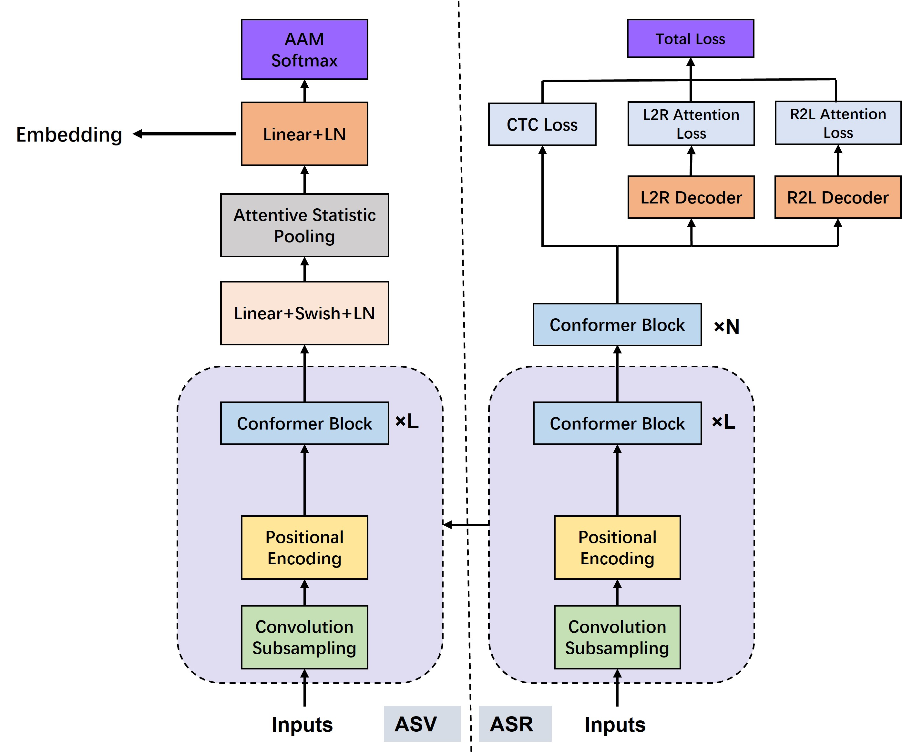
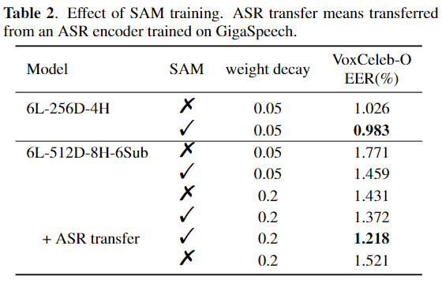
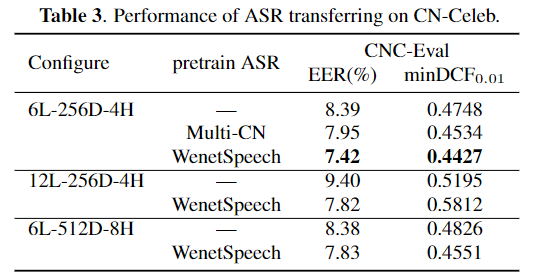

# ASR transferring for ASV conformer

#### Baseline ASV conformers are conducted on VoxCeleb and CNCeleb.
* VoxCeleb: `subtools/recipe/voxcelebSRC/runVoxcelebSRC_online.sh`
* CNCeleb: To be released.

#### ASR transferring is conducted on CNCeleb
 

  
 
* The pretrained ASR encoder can be either an open source pretrained model or trained from scratch.
* Parts but not all of the ASR encoder tends to achieve a better performance.
* Sharpness-Aware Minimizationis (SAM) training seems to effeciently alleviate overfitting.

#### Results:
 

<figure >
    
    
</figure>

#### Runtime is based on libtorch, go to `subtools/runtime` and evaluate your models' RTF.