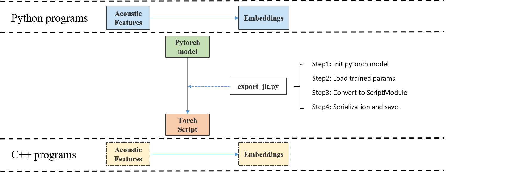

# ASV Runtime
This Runtime is based on LibTorch. Models trained by Pytorch can be converted to TorchScrip by torch JIT, then employed in C++ applications. 
* Fearture extraction: [Kaldifeat](https://github.com/csukuangfj/kaldifeat)
* Inference: LibTorch

<div align='center'>

</div>

### Local build

Build extractor_main. cmake > 3.14, gcc > 5.

```bash
mkdir build && cd build && cmake .. && cmake --build .
```

```
# project
.
|-- CMakeLists.txt
|-- README.md
|-- cmake
|-- bin
|   `-- extractor_main.cc
|-- build
|   |-- extractor_main
|   `
|-- fc_base
|-- test   
|   |-- wav
|   |-- gen_jit.py
|   |-- wav.scp
|   |-- feat_conf.yaml
|    `-- test.sh
`
```
### Evaluate RTF

The follow script will generate jit models and extract xvectors of wavs in `./test/wav`
```bash
cd ./test
python3 gen_jit.py
./test.sh
```
### Construct your own directory

1. export your model. 

    Go to your project directory which contains subtools.

    ```shell
    model_dir=exp/resnet34                        # directory of your model
    epoch=4                                       # model_checpoint eg. epoch=18

    subtools/pytorch/pipeline/export_jit_model.sh --model-dir $model_dir --model-file $epoch.params \
                                                  --output-file-name $epoch.pt \
                                                  --output_quant_name ${epoch}_quant.pt
    ```
2. Back to `test` of this directory, and move the model and feats config to your runtime directory, 
    ```
    # project
    .
    |-- model
    |   |--resnet34
    |   `  |--4.pt
    |      |--config
    |      `  |--feat_conf.yaml
    |-- wav   `
    |-- gen_jit.py
    |-- wav.scp
    |-- feat_conf.yaml
    |-- test.sh
    `

3. execute. 
    ```bash
    ./test.sh --model_path ./model/resnet34/4.pt \
              --feat_conf ./model/resnet34/config/feat_conf.yaml
    ```
Thansk to [Wenet](https://github.com/wenet-e2e/wenet/tree/main/runtime) project for their contribution of production works.
